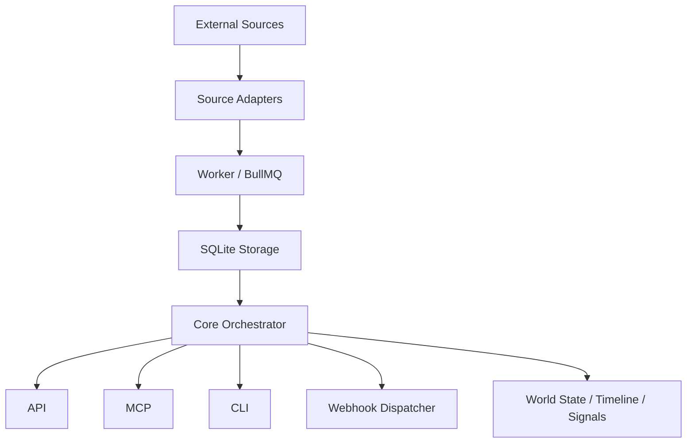

# WebHot

**AI Agent 的实时世界状态系统**

WebHot 持续观察互联网世界，把分散的热点、变化、扩散和风险整理成可查询的 `World State`、`Timeline` 和 `Signal`，再通过 API、MCP、CLI、Webhook 交给 Agent 使用。

---

## Why WebHot

WebHot 不是新闻聚合器，也不是普通热榜 API。它做的是一条更完整的链路：

```text
持续采集 → 语义分析 → 变化检测 → 时间线沉淀 → 信号生成 → Agent 消费
```

- **Pull**：MCP、CLI 让 Agent 主动查询世界状态
- **Push**：Webhook 把重要变化主动推给外部系统
- **State**：SQLite 里保留世界变化、时间线和信号

---

## What It Ships

| 面向 | 能力 | 入口 |
|---|---|---|
| API | 热点、时间线、信号、世界状态查询 | Fastify |
| MCP | 面向 Agent 的工具调用 | `@modelcontextprotocol/sdk` |
| CLI | 终端里直接看热点、趋势、时间线 | `webhot` |
| Worker | 定时采集与入库 | BullMQ + Redis |
| Webhook | 事件主动推送 | HMAC 签名 + 重试 |

---

## Quick Start

### 1. 安装依赖

```bash
./scripts/setup.sh
```

### 2. 启动 Redis

WebHot 的 worker 使用 Redis 做队列和调度。你可以任选一种方式：

```bash
# macOS
brew services start redis

# 或 Docker
docker run -d --name webhot-redis -p 6379:6379 redis:7-alpine
```

验证一下：

```bash
redis-cli ping
```

### 3. 启动全部服务

```bash
./scripts/dev.sh all
```

如果你只想启动部分服务：

```bash
./scripts/dev.sh api
./scripts/dev.sh mcp
./scripts/dev.sh worker
./scripts/dev.sh webhook
```

---

## What You Will See

启动后，终端会显示一个更清晰的控制台面板：

- 当前运行模式
- Node / pnpm / Redis 状态
- API / Worker / Webhook / MCP 的启动状态
- 每个服务自己的摘要面板

这比一串 `pnpm` 前缀和原始 JSON 日志更适合本地开发，也更方便排查问题。

---

## Architecture



### Pipeline

```text
Sources → Adapters → Ranking / Semantic / Perception → Storage → Core → API / MCP / CLI / Webhook
```

---

## Repository Layout

```text
webhot/
├── apps/
│   ├── api/              Fastify API server
│   ├── cli/              Command-line client
│   ├── mcp/              MCP server (stdio)
│   ├── worker/           Redis-backed ingestion worker
│   └── webhook-worker/   Event dispatcher
├── packages/
│   ├── core/             Orchestrator
│   ├── adapters/         Source adapters
│   ├── logging/          Shared console logger
│   ├── perception/       Snapshot + diff
│   ├── ranking/          Scoring
│   ├── semantic/         Classification + tagging
│   ├── signal/           Signal generation
│   ├── storage/          SQLite repositories
│   ├── timeline/         Topic timelines
│   └── schemas/          Shared types
├── configs/              Sources / categories / webhooks
├── docs/                 Design specs
├── scripts/              Local workflow helpers
└── docker-compose.yml
```

---

## Useful Commands

### Root scripts

```bash
./scripts/setup.sh     # install + typecheck + build
./scripts/dev.sh all   # start api + worker + webhook + mcp
./scripts/build.sh     # typecheck + build
./scripts/clean.sh     # remove build outputs
```

### CLI

```bash
pnpm --filter @webhot/cli dev -- state
pnpm --filter @webhot/cli dev -- trending -c AI
pnpm --filter @webhot/cli dev -- timeline MCP
pnpm --filter @webhot/cli dev -- ai --markdown
pnpm --filter @webhot/cli dev -- finance --json
```

### API

```text
GET  /health
GET  /api/v1/hot?category=AI&platform=github&limit=20
GET  /api/v1/hot/search?q=MCP
GET  /api/v1/hot/trending?category=Finance
GET  /api/v1/topics
GET  /api/v1/topics/exploding
GET  /api/v1/topics/:id/cluster
GET  /api/v1/timeline/:topicId
GET  /api/v1/signals
GET  /api/v1/signals/:type       (ai / finance / explosion / risk / cross_platform)
GET  /api/v1/world
GET  /api/v1/map/a-share?topic=HBM
POST /api/v1/ingest              { items: HotItem[] }
```

### MCP Tools

| 工具 | 说明 |
|---|---|
| `get_hot_list` | 获取热点列表 |
| `search_hot` | 搜索热点 |
| `get_trending_topics` | 获取升温最快的主题 |
| `get_world_state` | 获取当前世界状态 |
| `get_topic_timeline` | 获取话题时间线 |
| `explain_topic` | 解释热点重要性 |
| `search_world` | 搜索 WebHot 世界状态 |
| `get_finance_signals` | 获取金融信号 |
| `get_ai_trending` | 获取 AI 趋势信号 |
| `get_topic_relationships` | 关联分析 |
| `get_topic_cluster` | 获取话题聚类详情 |
| `map_to_a_share` | 热点映射到 A 股 |
| `get_exploding_topics` | 获取正在爆发的主题 |

---

## Data Sources

| 适配器 | 平台 | 类型 |
|---|---|---|
| NewsNow | 微博 / 知乎 | API |
| TopHub | 热榜聚合 | HTML |
| SoPilot | 社交媒体 RSS | RSS |
| GitHub Trending | 开源趋势 | API |
| Hacker News | 技术社区 | API |
| Reddit | programming / technology / artificial | API |
| Twitter / X | 社交网络 | API (Nitter) |
| Finance News | 财经资讯 | API / HTML |

新增数据源的方式很直接：

1. 在 `configs/sources.yaml` 里增加配置
2. 在 `packages/adapters/` 里实现 `HotSourceAdapter`
3. 让 `worker` 定时抓取即可

---

## Configuration

### `configs/sources.yaml`

```yaml
sources:
  - id: hackernews
    adapter: hackernews
    interval: 300
```

### `configs/categories.yaml`

```yaml
categories:
  AI:
    keywords: [llm, ai, agent, openai, claude, mcp]
  Finance:
    keywords: [stock, hbm, gpu, semiconductors]
```

### `configs/webhooks.yaml`

```yaml
webhooks:
  - id: my_agent
    url: http://localhost:4000/webhook/webhot
    secret: my-secret
    events: [topic.exploding, signal.ai, signal.finance]
    retryMax: 3
    timeoutMs: 10000
```

---

## Core Engines

- **Perception Engine**: 采集 HotItem，生成 Snapshot，做 Diff
- **Ranking Engine**: 多维热度评分
- **Timeline Engine**: 把变化串成时间线
- **Semantic Engine**: 自动分类、标签提取、A 股映射、风险识别
- **Signal Engine**: 生成 `explosion / cross_platform / finance / ai / risk` 五类信号
- **Lightweight Cluster Engine**: 基于中文 bigram / trigram + Jaccard 的轻量聚类

---

## Deployment

### Local development

```bash
./scripts/dev.sh all
```

### Docker Compose

```bash
docker compose up -d
```

> Compose 会同时带上 Redis，适合做本地一键环境或部署验证。

---

## Roadmap

- [x] 数据源适配器
- [x] API / MCP / CLI / Webhook
- [x] Timeline / Ranking / Semantic / Signal
- [x] BullMQ 采集队列
- [ ] Browser Adapter (Playwright)
- [ ] 推送渠道 (Telegram / 飞书 / Slack)
- [ ] PostgreSQL / Grafana / SDK

---

## Docs

| 文档 | 说明 |
|---|---|
| [架构设计规格](docs/webhot_mcp_architecture_specification_v_1.md) | 整体架构 + 数据模型 + MCP 设计 |
| [感知引擎规格](docs/webhot_perception_engine_technical_specification.md) | Perception / Diff / Topic 聚类 |
| [Agent 自动化规格](docs/webhot_agent_automation_integration_specification.md) | Agent 接入 + Timeline + CLI |
| [世界状态与 Timeline](docs/webhot_world_state_and_timeline_core_strategy.md) | World State + Change Database |
| [MCP / CLI / Webhook 规格](docs/webhot_mcp_cli_webhook_integration_specification.md) | Push / Pull 模型与边界 |

---

## License

MIT

---

## Support WebHot

如果这个项目对你有帮助，欢迎请我喝杯咖啡。你的支持会直接变成后续的数据源、推送通道、浏览器适配器和文档质量。

| 微信赞赏码 | 支付宝收款码 |
|---|---|
|  |  |

> 如果你打算在 GitHub 上长期公开这两个码，建议把仓库主分支设为保护分支，并开启 `CODEOWNERS` + 必需审查，避免图片被随手替换。
